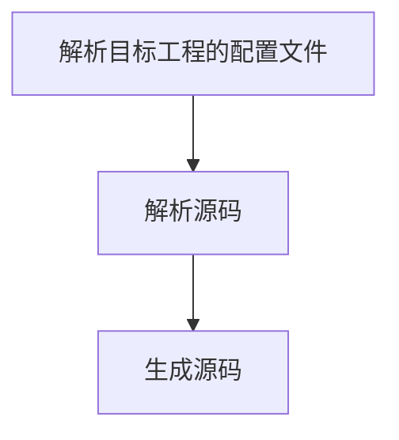
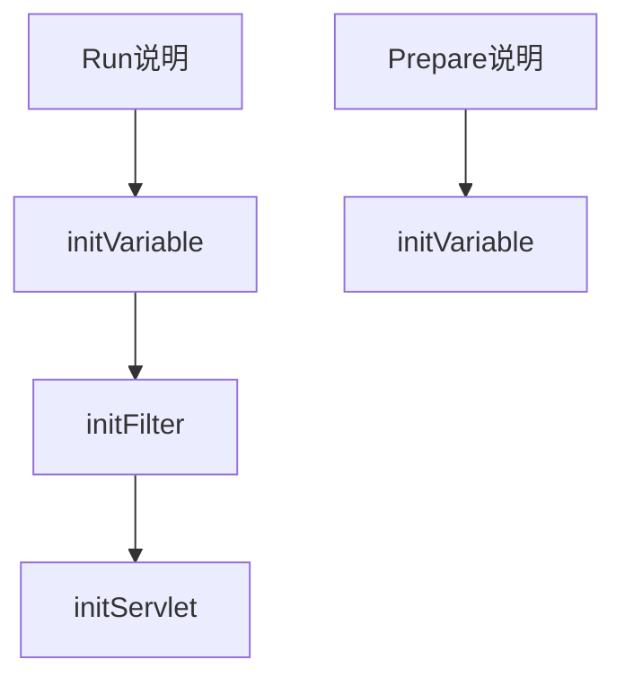

# 
# 解析说明
## 整体解析说明

## 源码解析过程
```
Project.parse => dirs.foreach(Package.parse)
Package.parse => file.foreach(goFile.parse)
goFile.parse => type.switch{create parser;parser.parse}
type => struct, interface, function, method ,variable
```

## 对象被管理
### 函数管理
函数在go 中分别为function和method；
1. function由package管理；
2. method由struct管理；
3. 这两者都抽象为FunctionManager进行管理
### struct 管理
struct 由package管理

## 对象管理
### FunctionManager
FunctionManager 管理了
1. initiator初始化函数；
2. servlet
3. creator
4. postAction 该函数在servlet执行后执行的函数；


# 产品定义
## 函数定义
1. type 该函数的功能说明rpc,filter,initiator,servlet,restful，creator
2. group 
3. method 该函数对外服务的方法 GET,POST
4. title 该函数的说明
5. url 该函数服务的url
其中type需要细化为
1. function type =〉 filter，initiator
2. method type =〉rpc, servlet，restful，postAction, creator

## struct定义
1. type 该struct的功能说明rpc,servlet,restful
2. group 
2. title 该struct的说明
3. url 该struct服务的url前缀
# 开发技巧
## funtion/method 将自己塞到functionManager中去；
1. function/method是被functionManager管理的，那是由functionManager来管理她，还是她把自己送到functionManager中去呢？
2. 目前由于统一使用createParser(参见goFile.parse)，然后调用了Parser.parse函数，导致让functionManager来管理function/method这个模式不现实， 因为其他代码没有这个逻辑，所以目前采用了function/method将自己送到functionManger的方法来实现；
3. 另外method在没有被解析之前，是不知道自己属于哪个functionMaanager的。所以也导致了他们需要将自己送到functionManager中去；


# 代码生成说明
## 代码执行顺序
排序执行顺序定义的生成代码的执行逻辑，后续代码需要按照该逻辑生成代码；
生成的代码最终对外暴露Prepare和Run函数；
1. Prepare完成代码初始化和注入工作；用于非servlet的功能，如cronjob或者test等；
2. Run则整个业务逻辑，filter，路由注入等；（该函数会主动调用prepare）

## initiator返回的管理
1. 由于initiator最后需要全局管理，全局排序；
2. 所以initiator一开始由function管理；
3. 但是最终按照相互依赖关系排序到project中；
### initiator函数生成；
1. initVariable按照各个package的initorator函数依赖关系依次调用；
2. 调用顺序首先保证依赖顺序；
3. 没有依赖关系的同级函数按照package顺序排序；
4. 同package中的函数按照函数名字排序；
5. 建立依赖关系时，会生成数组，按照数组生成变量，并调用函数即可；

### initiator依赖关系的建立
算法
1. foreach package；收集initiator functions；并创建variable map，
2. initiator functions按照name排序；
3. foreach initiator functions；
4. 从variableMap中寻找依赖关系，并记录到自己的parent中；
5. 对于每一个initiator,查看其父节点是否ready；
6. 父节点ready，则自己也ready，此时分配__global_xxx的变量名；
7. 放到最终的variableMap中；
8. 将自己放到readyNode列表；
9. 最终没有剩余functions, 则完成；
### 变量注入的来源
1. initiator产生的变量；
2. creator产生出来的；
3. 构造函数初始化出来的；

### project全局变量的管理
1. 所有initiaotr的返回值记录到全局管理中；
2. 依靠该变量建立initiator之间的依赖关系；

### 获取需要注入的变量
1. 同名的变量；
2. 同类型的变量；
3. 调用creator
4. 直接写结构体初始化；
为了便于查找变量，需要设计的数据结构；
1. map[*Struct][]Variable;


## 注册servlet函数
## 注册filter函数

## 主函数
1. 调用initiator函数，由于initiator有相互依赖，需要定义执行顺序；
2. 注册filter函数
3. 注册servlet函数

