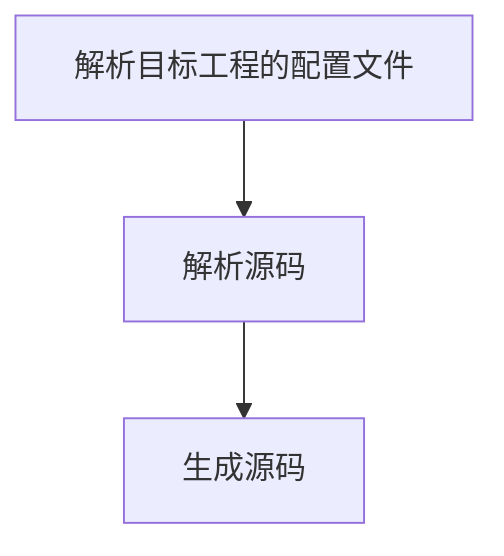

# 
# 解析说明
## 整体解析说明

## 源码解析过程
```
Project.parse => dirs.foreach(Package.parse)
Package.parse => file.foreach(goFile.parse)
goFile.parse => type.switch{create parser;parser.parse}
type => struct, interface, function, method ,variable
```

## 对象被管理
### 函数管理
函数在go 中分别为function和method；
1. function由package管理；
2. method由struct管理；
3. 这两者都抽象为FunctionManager进行管理
### struct 管理
struct 由package管理


## 功能定义
### 函数定义
1. type 该函数的功能说明 rpc,filter,initiator,servlet,restful，creator
2. group 
3. method 该函数对外服务的方法 GET,POST
4. title 该函数的说明
5. url 该函数服务的url
其中type需要细化为
1. function type =〉 filter，initiator
2. method type =〉rpc, servlet，restful，postAction, creator


# 代码生成说明

